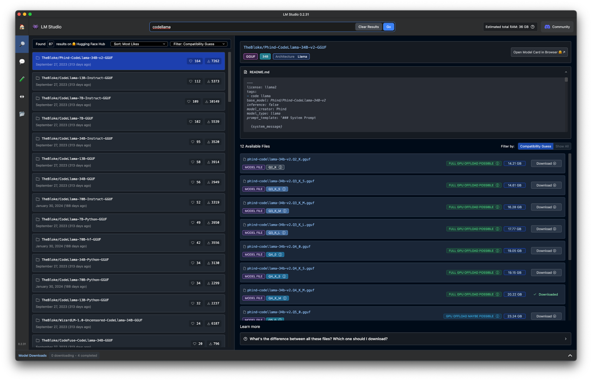

# Understanding Models Variations

Given LLMs' diverse capabilities, it's crucial to understand how different variations of these models can be tailored to specific tasks. Due to its flexibility and specialization, CodeLlama stands out as a robust choice for developers. However, the first time you search for CodeLlama in LM Studio, you’ll be surprised by how many results come back.

There are dozens of CodeLlama model variations that are optimized for different aspects of coding, ensuring that you can find one that fits your specific requirements. By leveraging these specialized models, you can significantly improve your development workflow, from speeding up code completion to handling complex coding tasks.

It’s not practical to go into every variation of the CodeLlama model but I’ve put together a chart to help you understand and review different options, their strengths, and their ideal use cases. Below is a table highlighting these variations:

| **Model**             | **Strengths**                                                | **When to Use**                                              |
| --------------------- | ------------------------------------------------------------ | ------------------------------------------------------------ |
| Phind CodeLlama       | Optimized for general coding tasks, providing a balance of precision and performance. Suitable for advanced coding tasks with high resource availability. | Good for generating code snippets, understanding coding contexts, and completing code. |
| CodeLlama Instruct    | Specifically designed for following instructions and generating code based on detailed problem statements or high-level descriptions. | Ideal for tasks where the model needs to understand and generate code from instructions, making it a better fit if your primary interaction involves explaining coding tasks to the LLM. |
| CodeLlama Completion  | Optimized for auto-completing code snippets, fast and efficient for real-time coding environments. | Best suited for enhancing IDE auto-complete functionality rather than instruction-based coding. |
| CodeLlama WizardCoder | Advanced capabilities for complex coding tasks, offering superior performance for sophisticated code generation. | Suitable for complex coding challenges but may be more resource-intensive than needed for basic instruction-based coding. |
| Starcoder             | Versatile, optimized for multiple programming languages and diverse coding scenarios. | Good if you work with various languages and need a flexible model, but might not be as specialized for instruction-based coding as CodeLlama Instruct. |
| Cohere Command R      | General-purpose model capable of handling a broad range of tasks, including coding. | Suitable for multi-functional environments where coding is one of many tasks, but not as specialized for instruction-based coding. |

Selecting the right model involves understanding the strengths and specific use cases of each variant. For instance, if your primary need is to generate code from detailed instructions, CodeLlama Instruct is particularly suited for this task. It's designed to follow instructions and create accurate, coherent code based on detailed problem statements or high-level descriptions. This is what we are going to focus on in this guide because the goal is to create a local LLM that can help us improve and speed up our coding.

Once you have selected a model, it’s essential to test it to ensure it meets your performance expectations. Running standardized tests will help you evaluate the model's response time, accuracy, and resource usage. This step ensures that the model is well-suited to your hardware capabilities and aligns with your specific coding needs. We’ll go into how to test these models later on. For now, it’s important to understand that you can’t just pick a model randomly and hope it works. The more time you spend understanding the model’s requirements and your computer’s limitations, the better its responses will be and the faster it will generate them.
