# AIMock: One Mock Server For Your Entire AI Stack

**Author:** [[anmol-baranwal|Anmol Baranwal]] (CopilotKit team)
**Format:** Article (dev.to / CopilotKit blog)
**URL:** https://dev.to/copilotkit/aimock-one-mock-server-for-your-entire-ai-stack-1jhp
**Published:** 2026-04-08
**Sponsor:** none disclosed (this is a first-party launch post by the vendor)

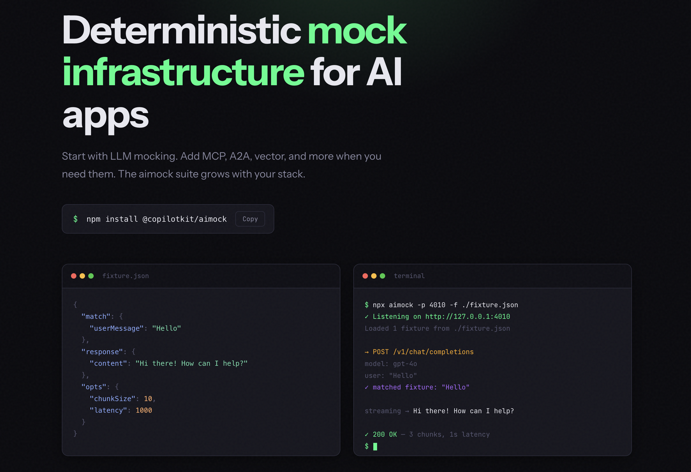

## Summary

CopilotKit launches **[[aimock|AIMock]]** — an open-source mock server (`@copilotkit/aimock`) that covers the **entire agentic AI stack**, not just the LLM. The thesis: a realistic 2026 agent request touches 6–7 services (LLM + MCP tool server + vector DB + reranker + web search + moderation + sub-agent over A2A); existing mock libraries cover one piece each, so most teams stitch 3–4 libraries together and still have gaps. AIMock unifies them in one binary with one config file. Beyond the unified mocking surface, AIMock introduces **three primitives no other AI mocking tool has shipped**: Drift Detection (daily three-way comparison against live providers, catches breakage within 24h), Record & Replay (VCR-style fixture capture), and Chaos Testing (inject 500s, malformed JSON, mid-stream disconnects). Used in production by the [[ag-ui|AG-UI protocol]]'s end-to-end test suite. **The wiki tracks AIMock as the canonical "deterministic CI for the agentic stack" entry — and as enabling infrastructure for the [[saas-death-spiral#shadow-factory-thread|shadow factory operating model]]**: any 3-person team shipping a complete agentic AI product needs determinism in their CI more than a 30-person team does, because they can't afford the ops overhead of debugging flaky tests across six services.

## Why this matters for the wiki

This source closes a gap the wiki has tracked implicitly across [[saas-death-spiral]], [[attractor]] (StrongDM 3-person factory), and [[summary-nate-b-jones-five-levels|the 5 Levels of AI Coding]]: **how does a tiny team running a complete agentic product survive CI flakiness across a 6-service request path?** Until this source, the wiki had no concrete answer beyond "they use a lot of mocks and pray." AIMock is the first piece of infrastructure the wiki has tracked that takes the problem seriously enough to ship a single tool covering the full surface — and to add three primitives (drift detection, record/replay, chaos) that map directly to the failure modes a small team can't afford to debug manually.

## What an agentic request actually looks like in 2026

The architectural framing the article opens with — and the framing the wiki should adopt for any "personal AI agent" or "agentic stack" discussion:

```
User message
→ LLM decides to use a tool
→ Tool call via MCP (file system, database, calendar)
→ RAG retrieval from Pinecone or Qdrant
→ Web search via Tavily
→ Cohere reranker to sort results
→ Back to LLM with full context
```

Each arrow is a live network call in your test environment. Each one can fail, return something slightly different, or cost tokens. **Mocking only the LLM means six other services are quietly making your test suite a lie.**

## The five mock surfaces

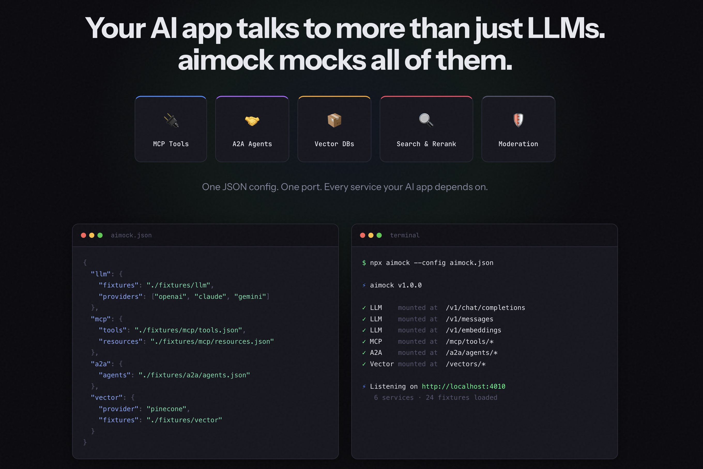

| Module | Surface | Notable detail |
|---|---|---|
| **LLMock** | 10 LLM providers (OpenAI, Claude, Gemini, Bedrock, Azure, Vertex AI, Ollama, Cohere, OpenRouter, Anthropic Azure) plus any OpenAI-compatible endpoint (Mistral, Groq, Together AI, vLLM). Full streaming, tool calls, structured outputs, extended thinking, multi-turn, WebSocket APIs. | Runs as a real HTTP server on a real port, not in-process patching. Any process can reach it: Next.js, agent workers, LangGraph, anything that speaks HTTP. One fixture format works across all providers — AIMock handles the translation internally. |
| **MCPMock** | Local MCP server speaking full JSON-RPC 2.0 over the Streamable HTTP spec. Tools, resources, prompts, full `Mcp-Session-Id` lifecycle. | Mounts onto LLMock so they share one port. Important for the wiki's [[mcp]] coverage — first MCP-mocking primitive in wiki. |
| **A2AMock** | The **[[a2a-protocol\|Agent2Agent (A2A)]]** protocol — agent card discovery, message routing, task management, SSE streaming between agents. | First A2A reference in the wiki. The protocol itself ([github.com/a2aproject/A2A](https://github.com/a2aproject/A2A)) is how multi-agent systems are starting to discover and talk to each other; A2AMock is the first wiki-tracked test primitive for it. |
| **VectorMock** | Mock vector database supporting Pinecone, Qdrant, and ChromaDB API formats. Collection management, upsert, query, delete. | Solves the "dev/staging/prod indexes don't match" problem for RAG pipelines. Static fixtures or dynamic per-query handlers. |
| **Services** | Tavily search, Cohere rerank, OpenAI moderation. *"The APIs everyone forgets to mock."* | String or regex pattern matching; first-match-wins; all requests recorded in journal for inspection. |

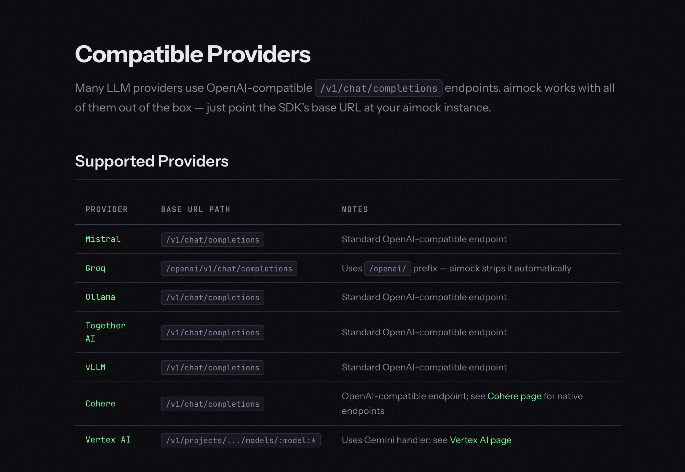

### How it compares to existing tools

The article opens with a comparison table making the case that no other tool covers the full agentic stack — every other option (MSW, VidaiMock, mock-llm, Mokksy, piyook) handles one or two pieces.

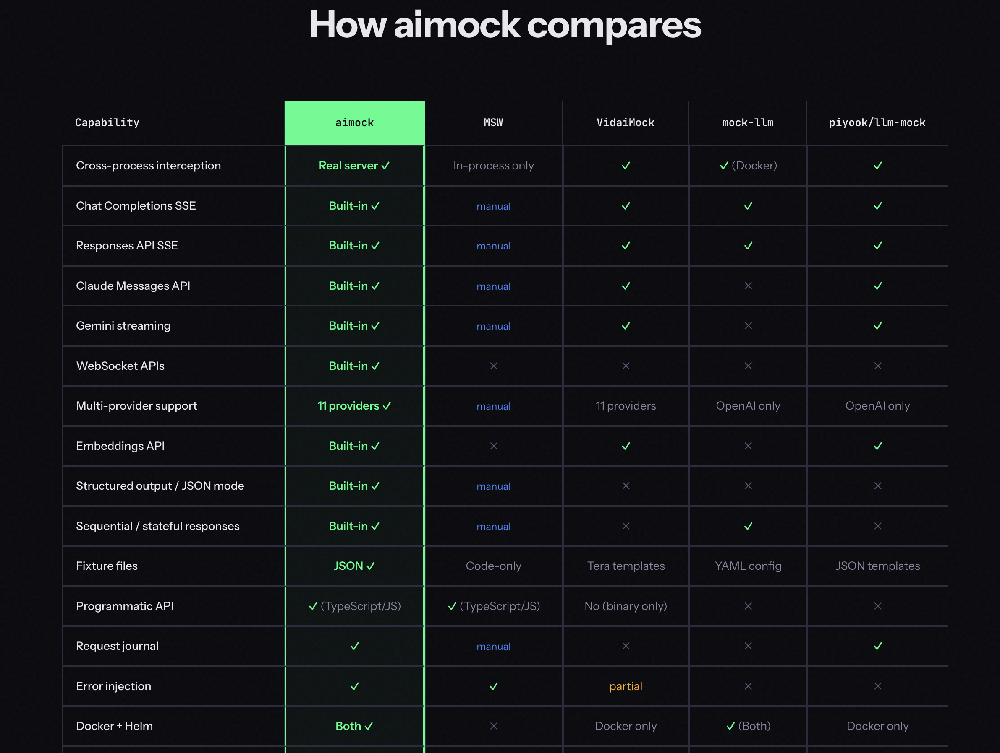
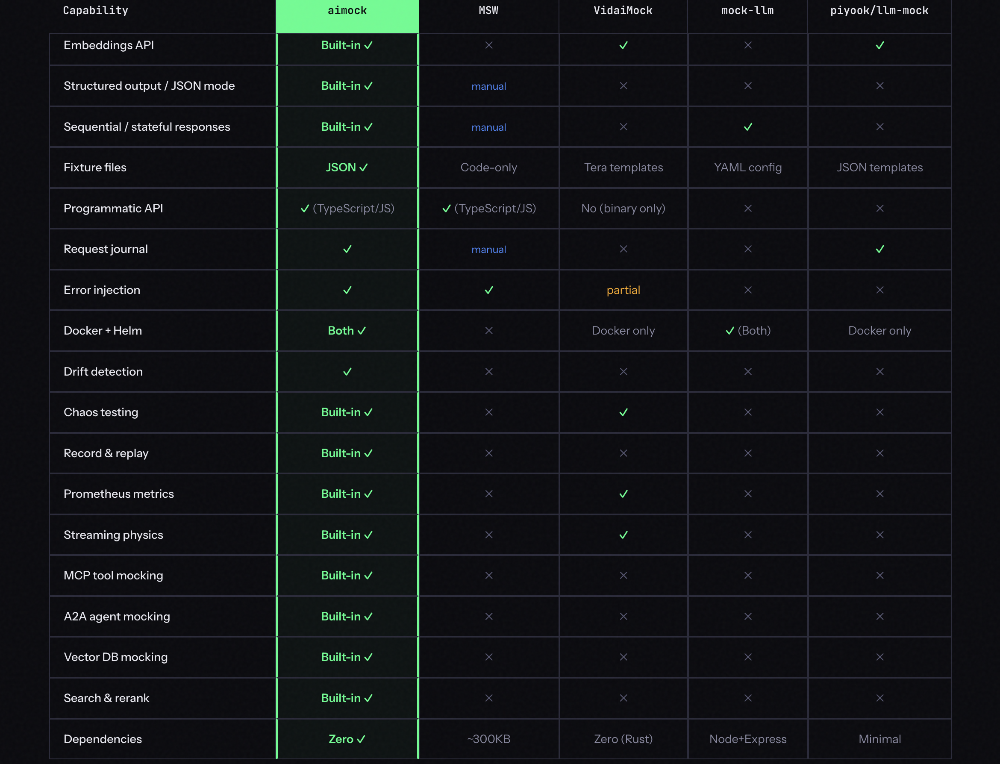

**Editorial note**: this is a vendor-published comparison table, so treat the gaps in competitor columns as marketing position. The unique-to-AIMock primitives (drift detection, record/replay across all surfaces, chaos at three levels) are technically verifiable from the GitHub repo; the "competitor doesn't do X" claims should be checked against each competitor's actual feature set before being relied on.

## The three load-bearing primitives

### 1. Drift Detection

The piece of AIMock that no other AI mocking tool ships. **A mock that does not match reality is worse than no mock.** Drift Detection runs daily in CI against live providers and does a three-way comparison:

1. **SDK types** — what the TypeScript types say the response shape should be
2. **Real API responses** — actual live calls to OpenAI / Anthropic / Gemini
3. **AIMock output** — what the mock returns for the same request

If any of those three disagree, the test fails — within 24 hours of the provider changing something, *not* when a user reports a bug.

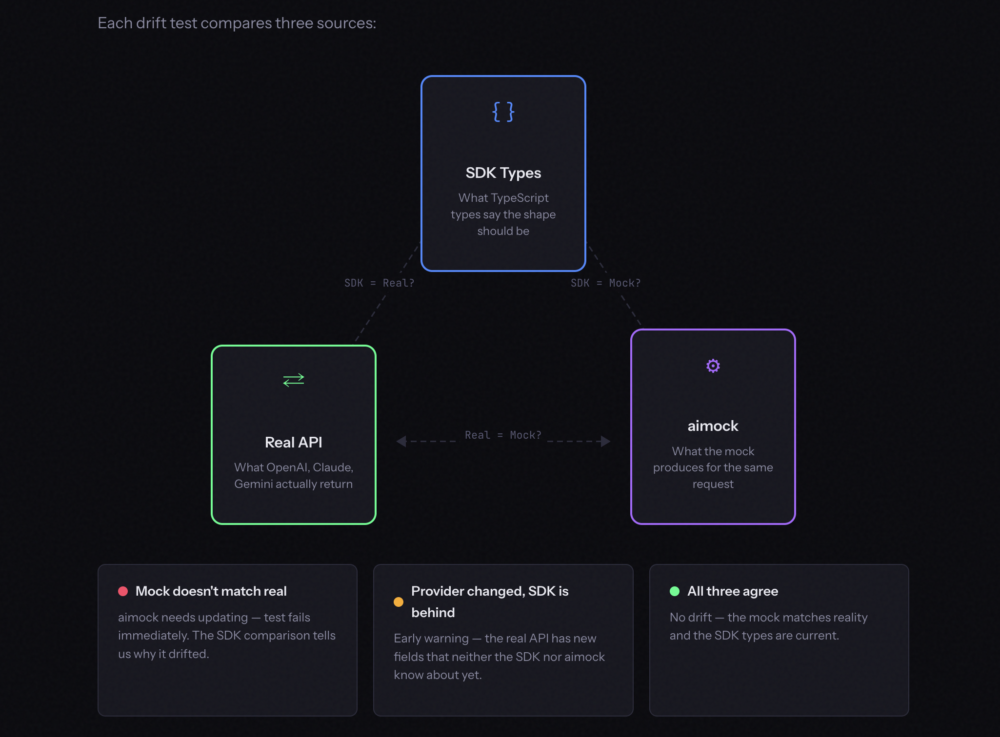

Severity levels:
- **Critical** — mock mismatches the real API, test fails immediately
- **Warning** — provider added a new field that neither SDK nor mock knows about yet, logged as early warning
- **OK** — all three sources agree

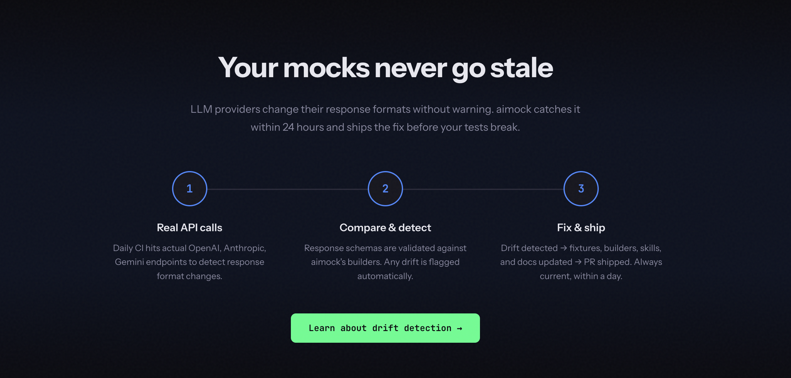

**Why this is structurally important**: every mock library in history has had the same bug — fixtures go stale silently. Drift detection is the first solution the wiki has seen that treats fixture staleness as a first-class CI failure.

### 2. Record and Replay

VCR-style fixture capture. The flow:

1. Client sends a request to AIMock
2. AIMock attempts fixture matching as usual
3. **On miss**: forward to the configured upstream provider
4. Upstream response is relayed back to the client immediately
5. **The response is collapsed (if streaming) and saved as a fixture to disk + memory**
6. Subsequent identical requests match the newly recorded fixture

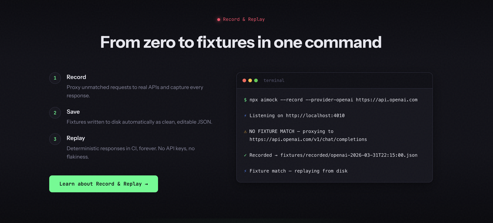

Stream collapsing is handled across **six formats**: OpenAI SSE, Anthropic SSE, Gemini SSE, Cohere SSE, Ollama NDJSON, Bedrock EventStream. Auth headers are forwarded upstream but never saved in fixtures.

**CI mode**: `--strict` turns unmatched requests into 503s that fail the test immediately, so missing fixtures can't slip through silently.

### 3. Chaos Testing

Inject failures at three levels (server-wide, per fixture, or per individual request via headers) at three failure modes:

- **drop** — HTTP 500 with `{"error":{"message":"Chaos: request dropped","code":"chaos_drop"}}`
- **malformed** — HTTP 200 with invalid JSON
- **disconnect** — destroy the TCP connection immediately with no response

Server-level chaos is configured by rates (e.g., 10% drop / 5% malformed / 2% disconnect). Per-request headers (`x-aimock-chaos-disconnect: 1.0`) override everything for forcing a specific failure in a single test. All chaos events tracked in the journal with a `chaosAction` field and counted in Prometheus metrics.

**Why this matters for hardening**: this is the offensive-side complement to [[ai-personal-agent-hardening]]. The hardening page captures *what attacks look like and how to defend*; chaos testing captures *how to verify your defenses survive provider failures*. Together they're the wiki's first concrete answer to "is this agent production-ready?"

## Other primitives worth noting

- **Embeddings** — `POST /v1/embeddings` fully supported. Return explicit vectors via fixtures or let AIMock generate them deterministically from a hash of the input text. Same input always produces the same vector; default 1536 dimensions. **Critical for RAG pipeline testing.**
- **WebSocket APIs** — OpenAI Realtime, OpenAI Responses over WebSocket, Gemini Live. Raw RFC 6455 framing. Voice and real-time agent coverage.
- **Sequential Responses** — return different responses for the same prompt on each successive call. Useful for retry logic and multi-turn workflows where the same message should behave differently over time.
- **Streaming Physics** — configurable `ttft` (time to first token), `tps` (tokens per second), and `jitter`. Pre-built profiles cover fast models, reasoning models, and overloaded systems. The wiki's first mention of latency simulation as a first-class testing primitive.
- **Prometheus Metrics** at `/metrics` — request counts, latency histograms, current fixture count.
- **Docker + Helm** — official image at `ghcr.io/copilotkit/aimock`; runs as plain HTTP so any language can use it. No Node.js needed on the test runner side.

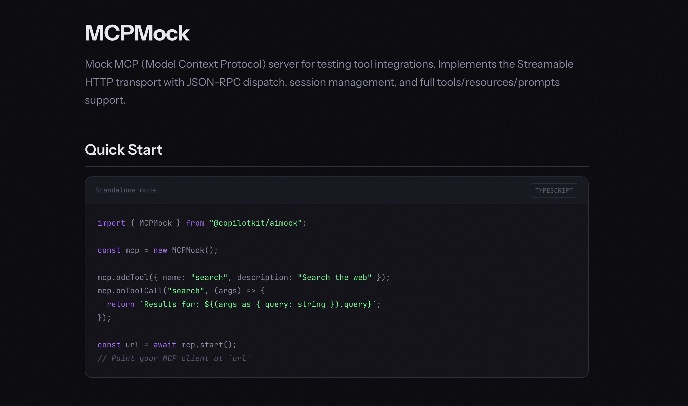

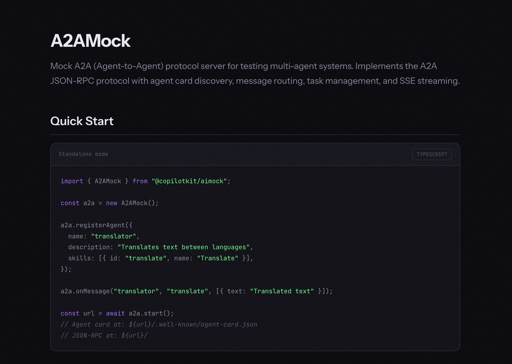

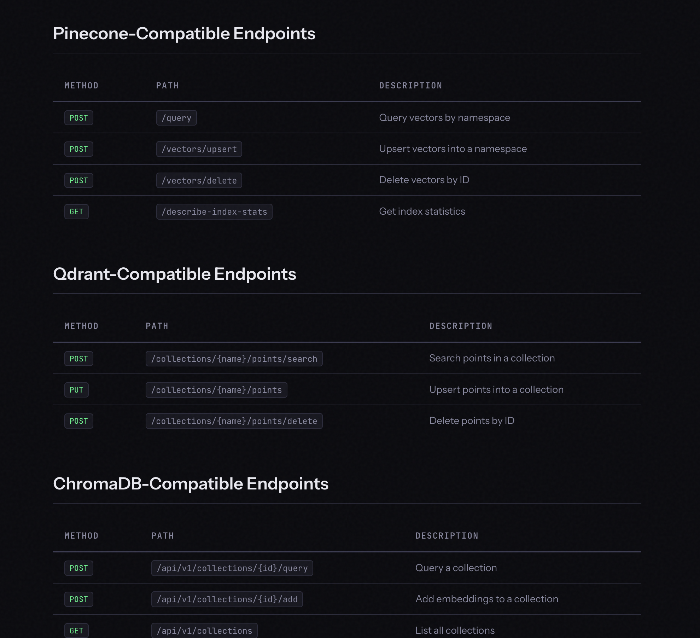

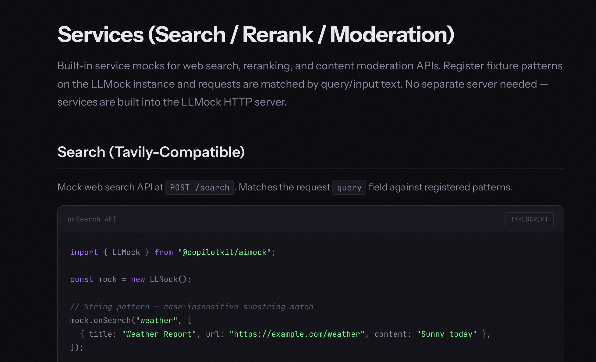

## AG-UI uses it in production

AIMock's flagship production user is **[[ag-ui|AG-UI]]** — the open protocol that connects AI agents to frontend applications, adopted by [[langgraph|LangGraph]], CrewAI, Mastra, Google ADK, and AWS Bedrock AgentCore. AG-UI's end-to-end test suite uses AIMock with fixture-driven responses across LLM providers. The repo at `apps/dojo/e2e/fixtures/openai` is the canonical "what an AIMock setup at scale looks like" reference.

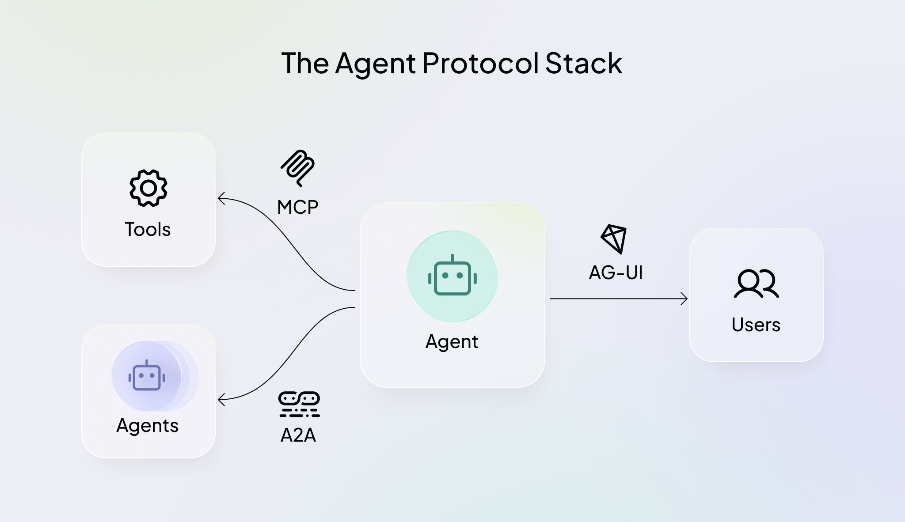

**Why it matters that AG-UI uses it**: AG-UI is adopted by major agent frameworks. AIMock having a real production user (not just the vendor's own marketing) is the strongest signal so far that the unified-mocking approach actually works at scale.

## Connection to the shadow factory thread

User flagged this source with the framing: *"Nate talked about a shadow factory company that mocks up all their API endpoints — this is one piece of that pattern."* The wiki's [[saas-death-spiral]] open question and the [[attractor]] (StrongDM 3-person factory) entry both reference small-team agentic ops without a concrete tooling story.

**The connection AIMock makes load-bearing**: a 3-person shadow-factory team shipping a complete agentic AI product needs determinism in their CI more than a 30-person team does, because they have *no ops capacity to debug flaky tests across six services*. AIMock is the first wiki-tracked piece of infrastructure that takes that constraint seriously. The drift detection primitive is especially load-bearing — a shadow factory cannot afford to find out a provider changed something when a customer files a bug.

**Honest gap**: the wiki does not yet have a primary source naming the specific company Nate B Jones referenced as mocking all their API endpoints. AIMock is *infrastructure for that pattern*, not necessarily *the company doing it*. Tracked as a follow-up in tasks.md.

## Migration paths

The article includes migration guides from MSW, VidaiMock, mock-llm, Python mocks, and Mokksy. **MSW users don't have to replace everything** — keep MSW for general REST/GraphQL mocking and use AIMock only for AI endpoints. Existing `@copilotkit/llmock` users get a find-and-replace upgrade (`pnpm remove @copilotkit/llmock && pnpm add @copilotkit/aimock`) — the `LLMock` class, all fixture formats, and the programmatic API are unchanged.

## Bias notes

This is a **first-party vendor launch post** by Anmol Baranwal on the CopilotKit team. Not sponsored, but the entire piece is positioning content for CopilotKit's own product. Treat the comparison table claims as marketing position; treat the technical features (the 5 mock surfaces, the 3 unique primitives, the 10 LLM providers, the supported protocols) as descriptive — they're verifiable against the public GitHub repo. The "AG-UI uses it in production" claim is also verifiable via the linked test suite path. The strongest editorial signal that the product is real and not vaporware: existing `@copilotkit/llmock` users (a separate, prior package the same team shipped) are migrating to AIMock as a renamed superset, which means the codebase has at least the LLMock history of production use.

## Notable Quotes

> "A single agent request in 2026 can touch six or seven services before it returns a response: the LLM, an MCP tool server, a vector database, a reranker, a web search API, a moderation layer, and a sub-agent over A2A. Most teams mock one of them. The other six are live, non-deterministic, and quietly making your test suite a lie."

> "A mock that does not match reality is worse than no mock."

> "Your test suite should be as complete as your stack."

## Connected Pages

- [[aimock]] — primary entity
- [[copilotkit]] — vendor org
- [[anmol-baranwal]] — author
- [[ag-ui]] — flagship production user (open protocol used by LangGraph, CrewAI, Mastra, Google ADK, AWS Bedrock AgentCore)
- [[a2a-protocol]] — Agent2Agent protocol (A2AMock surface)
- [[mcp]] — MCPMock is the first MCP-mocking primitive in the wiki
- [[saas-death-spiral]] — connects to the shadow-factory thread; AIMock is enabling infrastructure for 3-person agentic teams
- [[attractor]] — StrongDM 3-person factory; conceptual sibling
- [[ai-personal-agent-hardening]] — chaos testing is the offensive-side complement to the defensive hardening discipline
- [[llm-design-patterns]] — adjacent (deterministic mocks are infrastructure for testing the workflow patterns)
- [[langchain-library]], [[langgraph]] — AG-UI adoption frameworks

## See Also
- [[summary-nate-b-jones-five-levels|Source: 5 Levels of AI Coding]] — the L4/L5 dark factory operating model AIMock enables
- [[summary-simon-scrapes-claude-code-workflows|Source: Claude Code workflow patterns]] — adjacent infrastructure (workflow patterns vs. testing infrastructure)
- [Original (with localized images)](../../raw/archive/AIMock%20One%20Mock%20Server%20For%20Your%20Entire%20AI%20Stack.md)
